# RETO: NUEVA EXPERIENCIA EN EMPRESAS DE BUSES

* **TRACK:** _ESPECIALIZACIÓN UX-DESIGNER_
* **CURSO:** _PRIMER PROYECTO DE UX_
* **UNIDAD 1:** _MI PRIMER PROYECTO UX_

***
## Equipo de trabajo

+ Ortiz Villafuerte, María Cristina.
+ Cisneros Torre, Yelitza.
+ Colqui Santos, L. Vanessa.
+ Cervera Huamaní, Darcy.
+ Siesquén Sánchez, Molly.
+ Valverde Mejía, Longhi.

***

## Descripción del reto

  Catalina una emprendedora viajera. Durante sus últimas vacaciones  estuvo viajando por todo latinoamérica. Durante estos viajes  tuvo que tomar muchos buses de todo tipo para llegar a ver los paisajes más lindos del continente. Durante sus viajes  se dio cuenta que existen aún muchas oportunidades para mejorar la experiencia de todos los usuarios de este tipo de transporte: horarios, embarques, desembarques, compra de tickets en los terminales, compra de tickets online, cancelaciones, cambios de pasajes, etc. Adicionalmente, se dio cuenta que todas las plataformas de venta de tickets de bus tienen cosas por mejorar en Chile, Perú y México.

***

## Objetivo

 Investigar más sobre los usuarios de este tipo de transporte; definir y probar un MVP.

 ***

 ## Desarrollo

 - Para la resolución del reto seguimos las estapas de DCU(Diseño Centrado en el Usuario).
 - Para la organización y planificación usamos la herramienta Trello,  [Nueva Experiencia en Empresa de Buses Trello](https://trello.com/b/mylfEcsR/retonueva-experiencia-en-empresas-de-buses).

 ## Etapas DCU (Diseño Centrado en el Usuario):

 ## A. Descubrimiento e Investigación

   ### Actividades:

   #### 1.- Formulación de las preguntas para la entrevista con usuarios y la encuesta online

   - A través de la herramienta: lluvia de ideas, logramos definir las preguntas para la entrevista; teniendo en consideración el objetivo identificado.
   [Preguntas para la entrevista con usuarios:](assets/documents/entrevista/ENTREVISTA-EMPRESA-BUSES.docx).
   [Preguntas para la encuesta online con usuarios:](https://docs.google.com/forms/d/1vt41tvkkN4uOYlEV_CwwjGsl9o1aFtyVo3kdzdL1qKo/viewform?edit_requested=true).

   #### 2.- Entrevista con usuarios (Plaza Norte y Javier Prado)

   - Recolección de datos presencial.

   - Terminal Terrestre Plaza Norte (8:30 am, martes 30 de enero): Se realizaron 12 entrevistas. Al término de las entrevistas nos solicitaron un permiso para tomar fotos, entrevistar u otra actividad dentro de la institución.
   
   .
   .

  - Agencias de buses Javier Prado (9:30 am, martes 30 de enero): Se realizaron 11 entrevistas.
   
   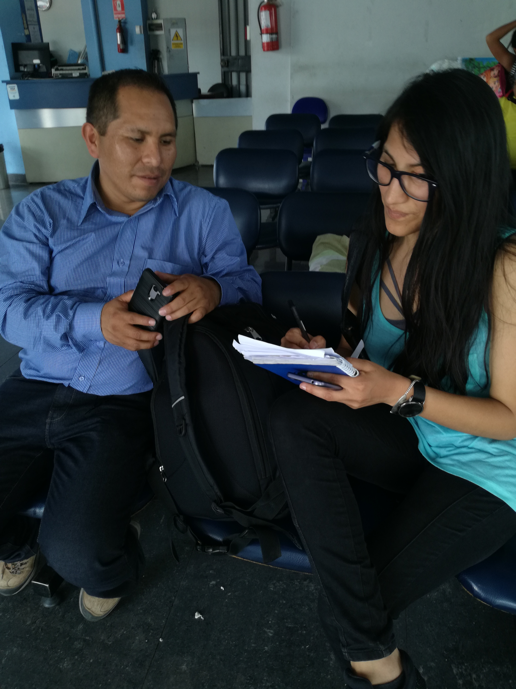.
   .

   #### 3.- Encuesta online a través de Google Drive

   - Recolección de datos online, a través de publicaciones en el facebook, correo electrónico, etc. Se obtuvo 36 respuestas.
   
   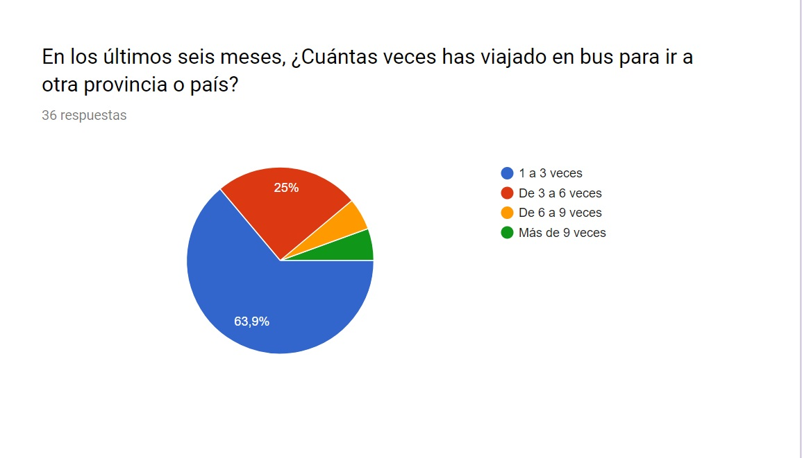.
   .
   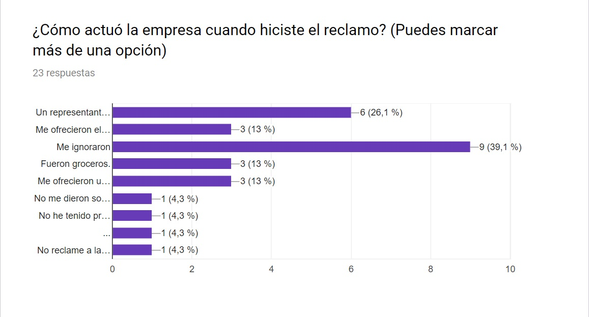.

   #### 4.- Investigación por internet ( web de empresas de buses, agencia de venta de pasajes, encuestas o estudios anteriores, foros, facebook, apps, etc)
   
   - Se identificaron los temas a investigar en internet: plataformas online, todo sobre las empresas de buses, etc.
   [Plataformas online de servicios de empresas de transporte](assets/documents/investigación/Plataforma-web-empresas.pptx).
   [Calificaciones de apps de empresas de transporte](assets/documents/investigación/Calificaciones_de_apps_de_agencias.xlsx).

 ## B. Síntesis y Definición

   ### Actividades:

   #### 1.- Definición del problema: Diagrama de afinidad.

   Se utilizó el diagrama de afinidad, a través los siguientes pasos:
   - Paso 1.- En posits se colocó los comentarios( cosas que no les gusta, cosas que desearían, quejas, cosas que no quedaron claras, etc) tal cual como los usuarios lo mencionaron sin interpretaciones ni deducciones; dichos usuarios fueron de las entrevistas personales que se hicieron en la terminal terrestre Plaza norte y las agencias en Javier Prado.
   
   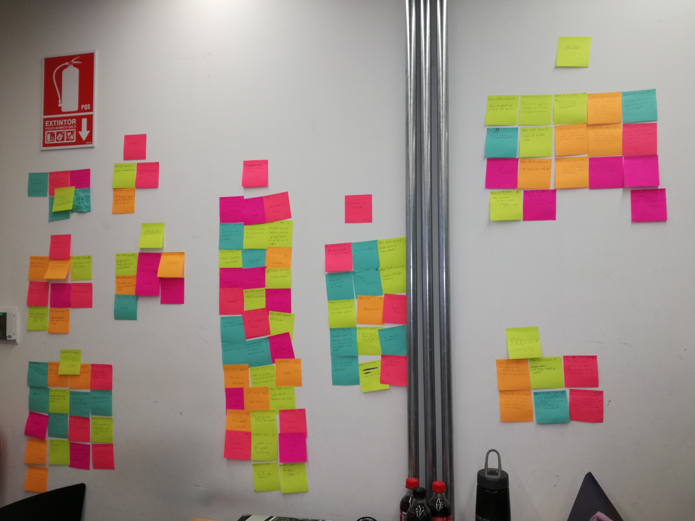.

   - Paso 2.-  Se agrupó  los posits por temas. El fin de esta actividad fue organizar lo recolectado para tener cosas claras y especificas  agrupadas en temas. Los temas que surgieron fueron: Precios/formas de pago, online, atención al cliente, presencial, horarios, ok sin quejas, raros, frecuencia de viajes, servicios dentro del bus.

   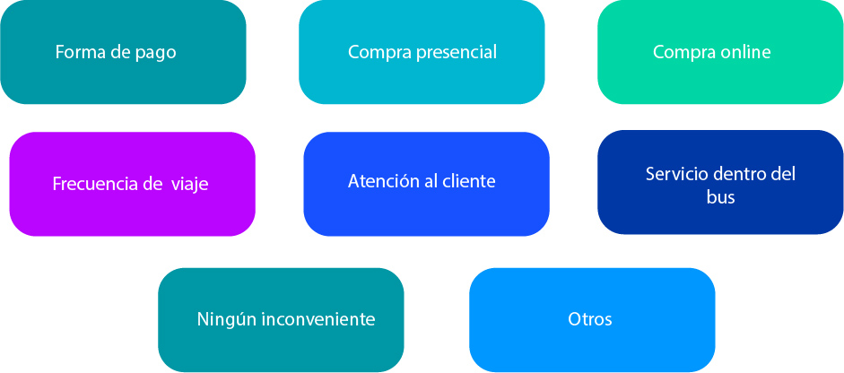.
   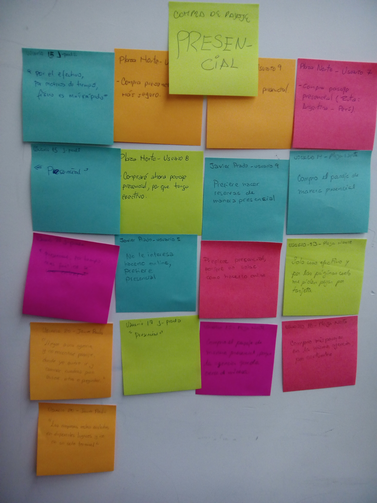.

   #### 2.- Priorizar a partir de los temas determinados en el diagrama de afinidad.
   
   - Para esta actividad se hizo una lluvia de ideas y se tomó en cuenta los resultados de las encuestas. 
   
   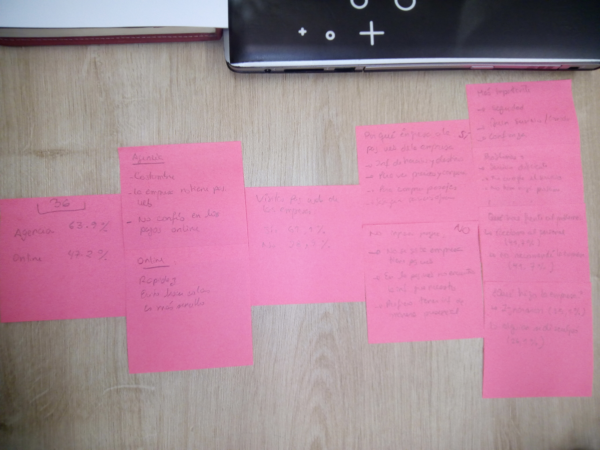.

   - Priorizamos los temas "Servicios dentro del bus" porque existían más usuarios con los mismos inconvenientes. Se priorizó también el tema "atención al cliente" porque si un servicio dentro del bus no es satisfactorio, el pasajero reclama y es necesario que dicha queja se atiendan de manera adecuada; de ahí la importancia de la relación entre los dos temas.

   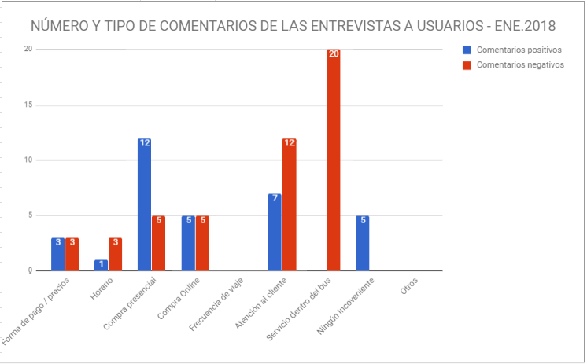.

   #### 3.- Elección el problema que se abordará.

   - El problema que se encontró es sobre: "No cumplimiento de los servicios que ofrecen dentro del bus y mala atención al hacer un reclamo".
   
   - ¿Porque? Deacuerdo a los temas elegidos en la actividad de priorización se entendió que los servicios dentro del bus que ofrecen las empresas (Asientos, calefacción, ventilación, limpieza, comida, atención de terramoza, etc) muchas veces no son ciertas o no se cumplen por completo; además cuando ocurre un reclamo estos no son atendidos, o medianamente atendidos dejando a los pasajeros insatisfechos.

   #### 4.- Benchmarking.

   Se realizó el benchmarking con las 7 principales empresas de tranportes del país. Para así conocer y comparar los servicios que ofrecen a los pasajeros.

   1. Transportes Cruz del Sur S.A.C

   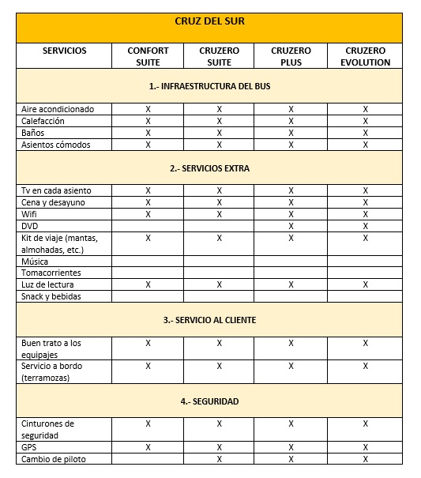.

   2. Turismo Civa S.A.C

   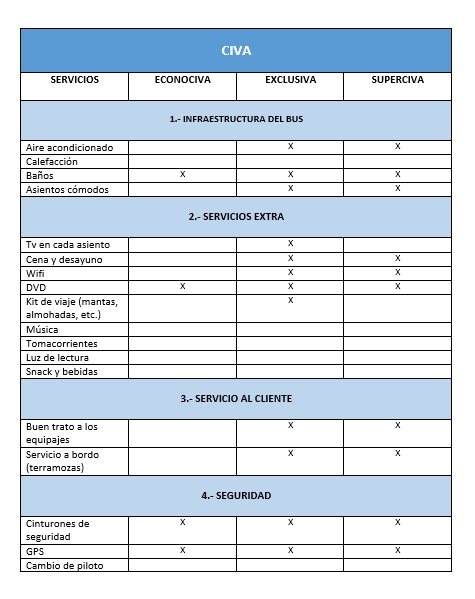.

   3. Empresa de Transportes Flores Hermanos S.C.R.LTDA.

   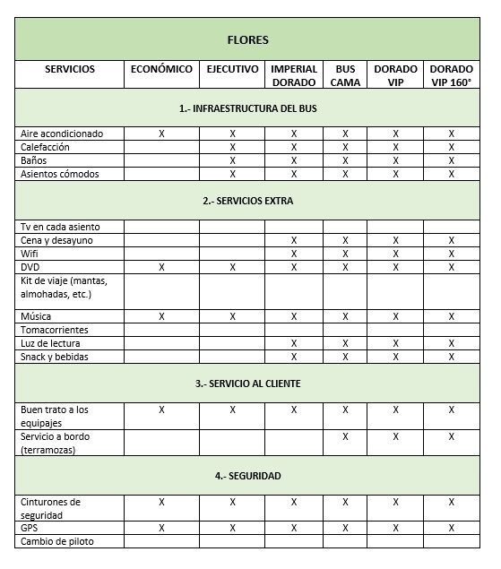.

   4. Movil Bus S.A.C

   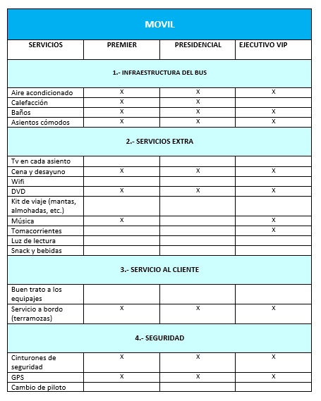.

   5. Oltursa

   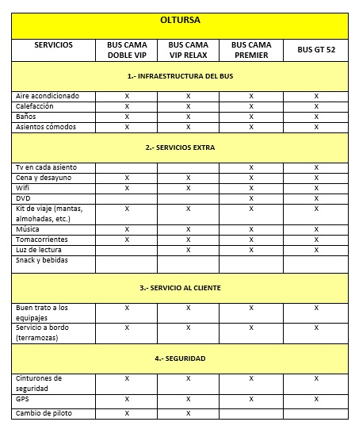.

   6. Tepsa

   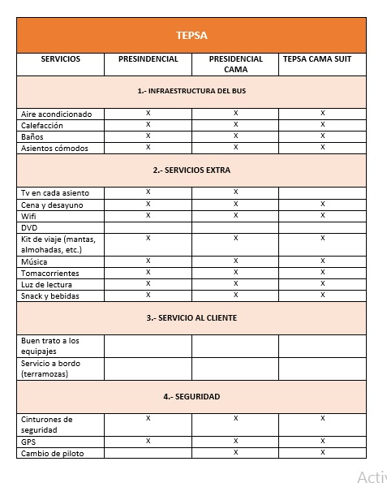.

   7. Transportes Línea S.A

   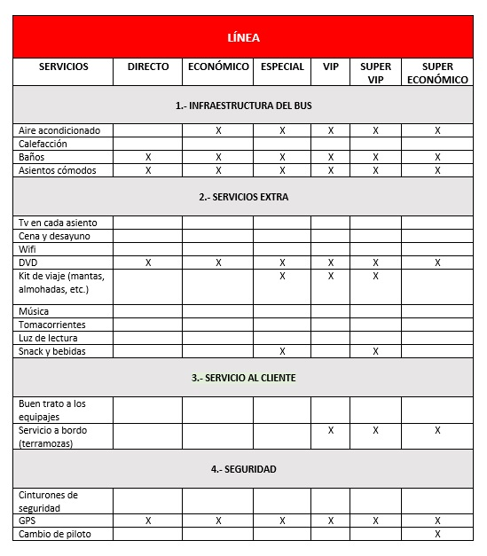.

   #### 5.- Definición de los User personas.

   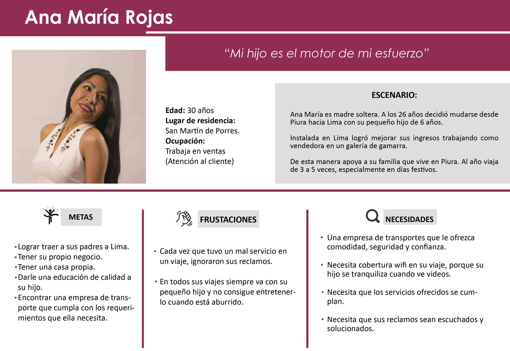.

   #### 6.- Definición de los Problems Statements.

  - **Ana María necesita** puntualidad en la salida y llegada del bus,**porque** es un valor que aprecia mucho; principalmente porque tiene niños pequeños.
  - **Ana María necesita** un conductor de confianza, **para** la seguridad de ella y sus hijos.
  - **Ana María necesita** asientos limpios, **para** viajar relajada.
  - **Ana María necesita** cinturones de seguridad en buenas condiciones, **porque** necesita viajar segura con sus hijos.
  - **Ana María necesita** tener certeza que el bus cumplirá con su hora de llegada al terminal, **para** evitar que su hijo se aburra demasiado con la espera.
  - **Ana María necesita** aire acondicionado y calefacción, **porque** viaja a zonas frías y tropicales con su familia.
  - **Ana María necesita** una plataforma donde su calificación/opinión sobre la empresa no sea borrada, **para** confiar en que la empresa implementará una solución.
  - **Ana María necesita** buen trato del personal de la empresa (terramozas), **porque** el trato amable es lo que más aprecia de un servicio.
  - **Ana María necesita** desayunos, almuerzos y cenas adecuados, **porque** viaja durante muchas horas.
  - **Ana María necesita** tener seguridad de que su equipaje llegará bien, **porque** lleva víveres para su familia.
  - **Ana María necesita** una plataforma segura donde poner sus reclamos,**para** sentirse escuchada y resolver sus problemas.
  - **Ana María necesita** wifi cuando viaja, **para** que su hijo no se aburran.
  - **Ana María necesita** un sistema que le asegure los verdaderos servicios que brinda la empresa, **para** poder elegir donde viajar.
  - **Ana María necesita** buena atención al subir al bus, **porque** viaja más de 8 horas a una zona calurosa.
  - **Ana María necesita** que el bus tenga aire acondicionado, **porque** realiza viajes largos al interior del país, con sus hijos.
  - **Ana María necesita** asientos cómodos

   #### 7.- Definición de lo HMW( How Might We?).

   - ¿Cómo podríamos entretener a los hijos de Ana María?
   - ¿Cómo podríamos verificar los servicios brindados, a través de las experiencias de los usuarios?
   - ¿Cómo hacer que el usuario sienta confianza al momento de elegir una empresa para viajar?
   - ¿Cómo podríamos ofrecer un buen servicio de wifi dentro del bus?
   - ¿Cómo podríamos darle garantía al usuario sobre el servicio adquirido?
   - ¿Cómo podríamos mejorar la atención a los reclamos de los pasajeros?
   - ¿Cómo podríamos brindar aire acondicionado y calefacción?
   - ¿Cómo podríamos hacer que la experiencia del viaje sea más segura?
   - ¿Cómo podríamos hacer que los reclamos sean escuchados y atendidos?
   - ¿Cómo podríamos adaptar el espacio del bus, para que Ana se sienta segura con su equipaje?
   - ¿Cómo podríamos hacer que las terramozas tengan un trato amable con los pasajeros?
   - ¿Cómo podríamos hacer el viaje más cómodo?
   - ¿Cómo podríamos asegurar que los equipajes no se extravíen o dañen?

   #### 8.- Definición de los WHAT IF?

   - **What if** ¿Las terramozas  enseñan o indican la seguridad dentro del bus?
   - **What if** ¿Hay un registro del servicio de las terramozas?
   - **What if** ¿Hay un mago en el bus?
   - **What if** ¿Hay un servicio personalizado para madres con noños de 0 a 5 años?
   - **What if** ¿El usuario pudiera programar la cena/comida que quiere recibir?
   - **What if** ¿El usuario pudiera calificar el servicio brindado?
   - **What if** ¿Viajar dentro del bus sea divertido, poniendo calificaciones dentro del bus?
   - **What if** ¿La empresa te envía un mensaje 30 minutos antes de que salga el bus?
   - **What if** ¿Hay un especialista en reclamos dentro del bus?
   - **What if** ¿El usuario pudiera programar los servicios que quiere recibir de acuerdo al precio a pagar?
   - **What if** ¿Hay un personal encargado de verificar la limpieza dentro del bus?
   - **What if** ¿Aplicamos las funcionalidades de Fitco?
   - **What if** ¿Qué tal si usamos las funcionalidades de Trivago?

   #### 9.- Definición de FEATURE LIST.

   ##### Plataforma de calificación del usuario.

  - **Perfil del usuario**
    - Registro de sesión con Facebook
    - Registro de sesión con Google
    - Registro de sesión con su email
  

  - **Sistema de calificación del servicio**
    - Notificación automática.
    - Opción de anonimato.
    - Opción de brindar una opinión.
    - Generación del enlace con la empresa para la solución del reclamo.
  

 ## C. Ideación

   ### Actividades:

   #### 2.- Realización de un Story board.

   Partiendo de nuestro user persona, creamos un storyboard, con los momentos que tiene el usuario a lo largo de su proceso de toma de desiciones respecto a su necesidad de encontrar una empresa de bus que cumpla con los servicios que ofrece y poder tener un viaje cómodo junto con su hijo.

   Así como también a tener más claro hacia dónde queremos llevar el diseño de nuestro producto y poder resolver de la manera más óptima la necesidad de nuestro usuario a cubrir.
  

   
   

 ## D. Prototipado

  ### Actividades:

  #### 1.- Realización del Prototype Content(02/02/2018 y 05/02/2018).

  [Prototype Content](https://docs.google.com/document/d/1Bdj6_rydMJWmwMQ-s1xbYqpjYtaZO5bo0jFTCYBNoxc/edit?usp=sharing)

  #### 2.- Realización del Paper Prototyping & Testing(06/02/2018).

  

 ## E. Testing

  ### Actividades:

  **I.- Testing del Prototype Content**
  
   Se hizo testing del Prototype Content con las compañeras de clase. La finalidad: obtener feedback para mejorar el flujo de nuestro producto antes de realizar el prototipado del MVP.

  1.- Entrevistas a 3 usuarios dentro de clase.    
  2.- El proceso consistió en explicar 1 a 1 el Content Prototype. con un tiempo de 15minutos por usuario.     
  3.- Después de recibir feedback se procedió a mejorar el Content Prototype.     
  4.- Finalmente pasamos a prototipar nuestras vistas.

  Se obtuvo los sgtes. Feedback's:
    
  **Testing 01:**

    * No entiendo, ¿qué hace la app?. ¿Es sólo para calificar el servicio de bus?.
    * Sí calificaría cada item, aunque sea largo.
    * Las primeras preguntas de adónde viajo o con qué empresa, para qué me sirven.

  **Testing 02:**

    * El logueo es con DNI o Ticket de Viaje.
    * Si el usuario marca La mayoría en negativo/positivo cómo miden eso para dar el mensaje positivo/negativo. Ejemplo (3 a 1)
    * Calificar en uno sólo todos los servicios.

  **Testing 03:**

    * Al hacer la encuesta de satisfacción, hacer una escala de satisfacción de "nada bueno" a "muy bueno".
    * La encuesta es muy larga.
    * Se necesitaría crear dos aplicaciones, una para el usuario y otra para la empresa.
    * En dónde guarda los datos que el usuario ya ha viajado.
      
  **Resultado final del Prototype Content**

  [Content Prototyping](https://docs.google.com/document/d/1Bdj6_rydMJWmwMQ-s1xbYqpjYtaZO5bo0jFTCYBNoxc/edit)

  **II.- Testing de Paper Prototype**

Después de un arduo proceso de Creación del Producto pasando por todas las etapas(descubrimiento e investigación, síntesis y definición, ideación, prototipado, testing). Se realizó un testing con 03 usuarios, con el fin de obtener feedback del producto creado y mejorar a través del tiempo.

1.- Luego del testing con el Protype Content, se realizaron las pruebas con el Prototype del Producto en clase.  
2.- En clase luego de varias horas de trabajo en el Prototype, se empezó a testear con 03 usuarios reales. Realizándose una previa entrevista y finalmente el proceso del testing[Se usó como base la "[Guía de usabilidad](https://docs.google.com/document/d/14IuWyDjKf7YbrObpoxhQxWEAqTISbaRvY6XF5NHZooQ/edit)" y "[Consentimiento](https://docs.google.com/document/d/11Op9jpjyub1_QO0LnH8LdwJTyJfu2daT52cEfFISueA/edit)"].  
3.- Finalmente se obtuvo un feedback de los 03 usuarios testeados y comenzamos a iterar.

