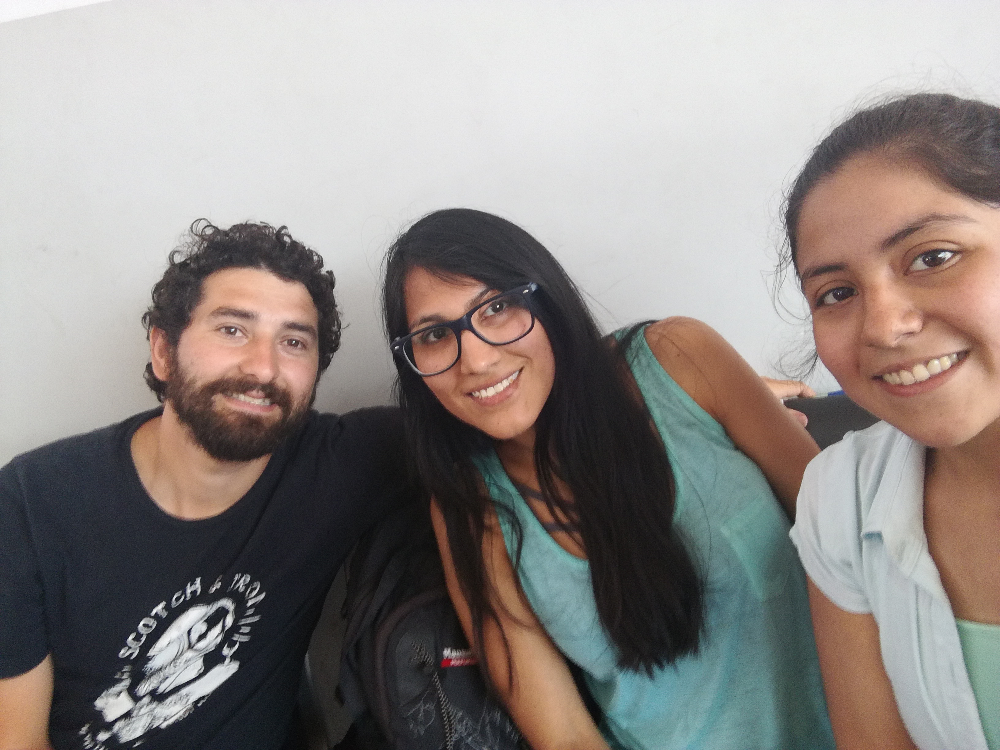
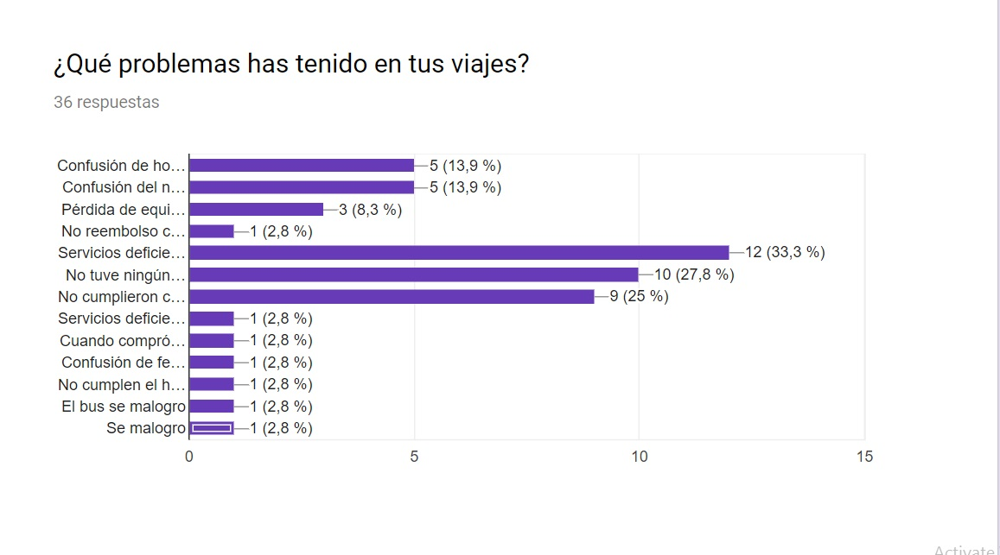
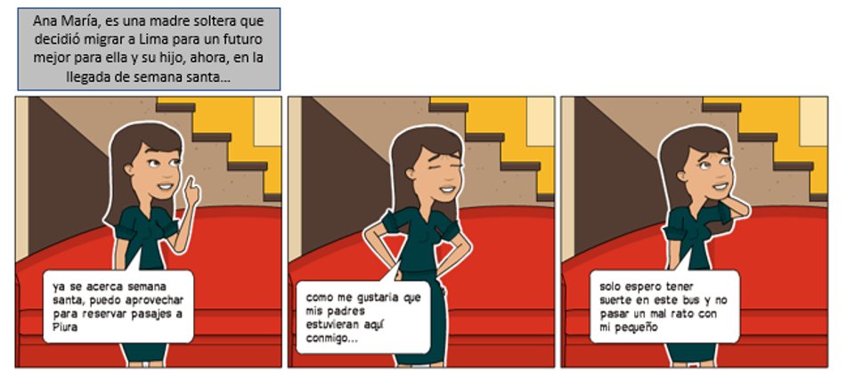
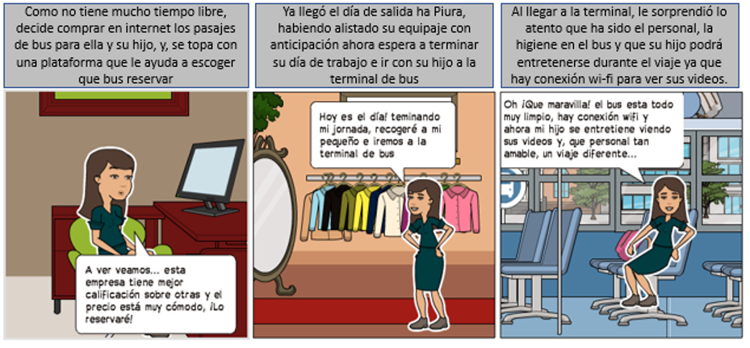

# RETO: NUEVA EXPERIENCIA EN EMPRESAS DE BUSES

* **TRACK:** _ESPECIALIZACIÓN UX-DESIGNER_
* **CURSO:** _PRIMER PROYECTO DE UX_
* **UNIDAD 1:** _MI PRIMER PROYECTO UX_

***
## Equipo de trabajo

+ Ortiz Villafuerte, María Cristina.
+ Cisneros Torre, Yelitza.
+ Colqui Santos, L. Vanessa.
+ Cervera Romaní, Darcy.
+ Siesquén Sánchez, Molly.
+ Longui.

***

## Descripción del reto

  Catalina una emprendedora viajera. Durante sus últimas vacaciones  estuvo viajando por todo latinoamérica. Durante estos viajes  tuvo que tomar muchos buses de todo tipo para llegar a ver los paisajes más lindos del continente. Durante sus viajes  se dio cuenta que existen aún muchas oportunidades para mejorar la experiencia de todos los usuarios de este tipo de transporte: horarios, embarques, desembarques, compra de tickets en los terminales, compra de tickets online, cancelaciones, cambios de pasajes, etc. Adicionalmente, se dio cuenta que todas las plataformas de venta de tickets de bus tienen cosas por mejorar en Chile, Perú y México.

***

## Objetivo

 Investigar más sobre los usuarios de este tipo de transporte; definir y probar un MVP.

 ***

 ## Desarrollo

 - Para la resolución del reto seguimos las estapas de DCU(Diseño Centrado en el Usuario).
 - Para la organización y planificación usamos la herramienta Trello,  [Nueva Experiencia en Empresa de Buses Trello](https://trello.com/b/mylfEcsR/retonueva-experiencia-en-empresas-de-buses).

 ## Etapas DCU (Diseño Centrado en el Usuario):

 ## A. Descubrimiento e Investigación

   ### Actividades:

   #### 1.- Formulación de las preguntas para la entrevista con usuarios y la encuesta online

   - A través de la herramienta: lluvia de ideas, logramos definir las preguntas para la entrevista; teniendo en consideración el objetivo identificado.
   [Preguntas para la entrevista con usuarios:](assets/documents/entrevista/ENTREVISTA-EMPRESA-BUSES.docx).
   [Preguntas para la encuesta online con usuarios:](https://docs.google.com/forms/d/1vt41tvkkN4uOYlEV_CwwjGsl9o1aFtyVo3kdzdL1qKo/viewform?edit_requested=true).

   #### 2.- Entrevista con usuarios (Plaza Norte y Javier Prado)

   - Recolección de datos presencial.

   - Terminal Terrestre Plaza Norte (8:30 am, martes 30 de enero): Se realizaron 12 entrevistas. Al término de las entrevistas nos solicitaron un permiso para tomar fotos, entrevistar u otra actividad dentro de la institución.
   .
   .

  - Terminal de buses Javier Prado (9:30 am, martes 30 de enero): Se realizaron 11 entrevistas.
   .
   .

   #### 3.- Encuesta online a través de Google Drive

   - Recolección de datos online, a través de publicaciones en el facebook, correo electrónico, etc. Se obtuvo 36 respuestas.
   .
   .

   #### 4.- Investigación por internet ( web de empresas de buses, agencia de venta de pasajes, encuestas o estudios anteriores, foros, facebook, apps, etc)
   
   - Se identificaron los temas a investigar: plataformas online, empresas de buses, etc.
   [Plataformas online de servicios de empresas de transporte](assets/documents/investigación/Plataforma-web-empresas.pptx).
   [Calificaciones de apps de empresas de transporte](assets/documents/investigación/Calificaciones_de_apps_de_agencias.xlsx).

 ## B. Síntesis y Definición

   ### Actividades:

   #### 1.- Definición del problema: Diagrama de afinidad.

   #### 2.- Priorizar a partir de los temas determinados en el diagrama de afinidad.

   #### 3.- Elección el problema que se abordará.

   #### 4.- Benchmarking.

   #### 5.- Definición de los User personas.

 .

   #### 6.- Definición de los Problems Statements.

  - **Ana necesita** puntualidad en la salidad y llegada del bus,**porque** es un valor que aprecia mucho; principalmente porque tiene niños pequeños.
  - **Ana necesita** un conductor que de confianza, **para** la seguridad de ella y sus hijos.
  - **Ana necesita** asientos limpios, **para** viajar relajada.
  - **Ana necesita** cinturones de seguridad en buenas condiciones, **porque** necesita viajar segura con sus hijos.
  - **Ana necesita** tener certeza que el bus cumplirá con su hora de llegada al terminal, **para** evitar que su hijo se aburra demasiado con la espera.
  - **Ana necesita** aire acondicionado y calefacción, **porque** viaja a zonas frías y tropicales con su familia.
  - **Ana necesita** una plataforma donde su calificación/opinión sobre la empresa no sea borrada, **para** confiar en que la empresa implementará una solución.
  - **Ana necesita** buen trato del personal de la empresa (terramozas), **porque** el trato amable es lo que más aprecia de un servicio.
  - **Ana necesita** desayunos, almuerzos y cenas adecuados, **porque** viaja durante muchas horas.
  - **Ana necesita** tener seguridad de que su equipaje llegará bien, **porque** lleva víveres para su familia.
  - **Ana necesita** una plataforma segura donde poner sus reclamos,**para** sentirse escuchada y resolver sus problemas.
  - **Ana necesita** wifi cuando viaja, **para** que su hijo no se aburran.
  - **Ana necesita** un sistema que le asegure los verdaderos servicios que brinda la empresa, **para** poder elegir donde viajar.
  - **Ana necesita** buena atención al subir al bus, **porque** viaja más de 8 horas a una zona calurosa.
  - **Ana necesita** que el bus tenga aire acondicionado, **porque** realiza viajes largos al interior del país, con sus hijos.
  - **Ana necesita** asientos cómodos

   #### 7.- Definición de lo HMW( How Might We?).

   - ¿Cómo podríamos entretener a los hijos de Ana?
   - ¿Cómo podríamos verificar los servicios brindados, a través de las experiencias de los usuarios?
   - ¿Cómo hacer que el usuario sienta confianza al momento de elegir una empresa para viajar?
   - ¿Cómo podríamos ofrecer un buen servicio de wifi dentro del bus?
   - ¿Cómo podríamos darle garantía al usuario sobre el servicio adquirido?
   - ¿Cómo podríamos mejorar la atención a los reclamos de los pasajeros?
   - ¿Cómo podríamos brindar aire acondicionado y calefacción?
   - ¿Cómo podríamos hacer que la experiencia del viaje sea más segura?
   - ¿Cómo podríamos hacer que los reclamos sean escuchados y atendidos?
   - ¿Cómo podríamos adaptar el espacio del bus, para que Ana se sienta segura con su equipaje?
   - ¿Cómo podríamos hacer que las terramozas tengan un trato amable con los pasajeros?
   - ¿Cómo podríamos hacer el viaje más cómodo?
   - ¿Cómo podríamos asegurar que los equipajes no se extravíen o dañen?

   #### 8.- Definición de los WHAT IF?

   - **What iff** ¿Las terramozas  enseñan o indican la seguridad dentro del bus?
   - **What iff** ¿Hay un registro del servicio de las terramozas?
   - **What iff** ¿Hay un mago en el bus?
   - **What iff** ¿Hay un servicio personalizado para madres con noños de 0 a 5 años?
   - **What iff** ¿El usuario pudiera programar la cena/comida que quiere recibir?
   - **What iff** ¿El usuario pudiera calificar el servicio brindado?
   - **What iff** ¿Viajar dentro del bus sea divertido, poniendo calificaciones dentro del bus?
   - **What iff** ¿La empresa te envía un mensaje 30 minutos antes de que salga el bus?
   - **What iff** ¿Hay un especialista en reclamos dentro del bus?
   - **What iff** ¿El usuario pudiera programar los servicios que quiere recibir de acuerdo al precio a pagar?
   - **What iff** ¿Hay un personal encargado de verificar la limpieza dentro del bus?
   - **What iff** ¿Aplicamos las funcionalidades de Fitco?
   - **What iff** ¿Qué tal si usamos las funcionalidades de Trivago?

   #### 9.- Definición de FEATURE LIST.

   ##### Plataforma del Gerente de la empresa de Transportes:

    - Perfil de usuario.
    - Sistema de reportes de calificación de los servicios.
    - Data con el registro de los usuarios frecuentes. 
  
   ##### Plataforma de calificación del usuario.

    - Sistema de registro via Facebook, Gmail o por un correo electrónico. 
    - Perfil de usuario.
    - Notificación para realizar la calificación.
    - Sistema de calificación de los servicios brindados por la empresa de transportes, a través de puntos.
    - Opción de brindar una opinión.
    - Opción para contactarse con el empresa, luego de realizar la calificación.

 ## C. Ideación

   ### Actividades:

   #### 1.- Realización de un Story board.
   
   

 ## D. Prototipado

  ### Actividades:

  #### 1.- Realización del prototype content.

  https://docs.google.com/document/d/1Bdj6_rydMJWmwMQ-s1xbYqpjYtaZO5bo0jFTCYBNoxc/edit?usp=sharing

 ## E. Testing

  ### Actividades:

  #### 1.- Testing del prototype content
